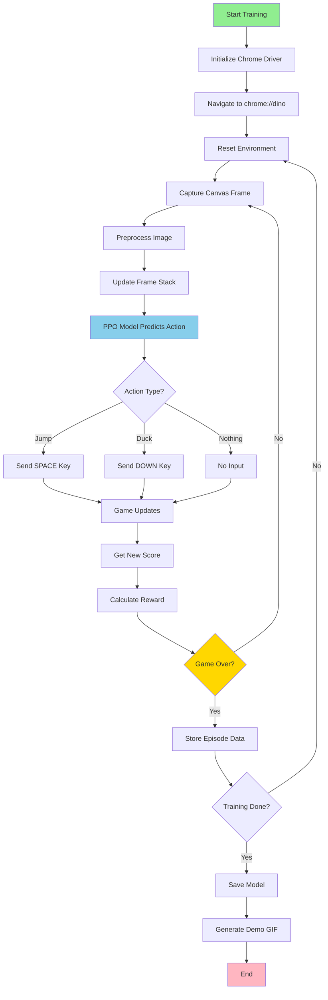

# Chrome Dino Game Reinforcement Learning with PPO

This project trains a reinforcement learning (RL) agent to master the **Chrome Dino** (T-Rex runner) game using **Stable-Baselines3 PPO** and a custom **OpenAI Gym** environment implemented with Selenium.

The agent learns through real-time interaction with the game, receiving shaped rewards for survival, progress, and score improvements while learning to avoid obstacles.

<p align="center">
  
</p>

---

## ✨ Features

- 🎮 **Custom Gym Environment** - Full OpenAI Gym-compatible environment for Chrome Dino
- 🧠 **CNN Policy** - Processes stacked grayscale frames for temporal awareness
- 🎯 **Advanced Actions** - Jump, duck, and do-nothing actions for obstacle avoidance
- 📸 **Real-time Frame Capture** - Direct canvas extraction via Selenium
- 🎨 **Intelligent Preprocessing** - Cropping, resizing, and contrast enhancement
- 💪 **Robust Error Handling** - Automatic recovery from driver failures
- 📊 **Shaped Rewards** - Survival bonuses, progress rewards, and death penalties
- 🎬 **Demo Recording** - Generate GIFs of agent performance
- 💾 **Smart Checkpointing** - Save best models based on evaluation performance
- 📈 **TensorBoard Support** - Monitor training metrics in real-time
- 🔧 **CLI Interface** - Easy command-line control for training and evaluation

---

## 🏗️ Architecture

### Environment Components

```
Game State → Selenium → Canvas Capture → Preprocessing → Frame Stack → CNN Policy → Action
     ↑                                                                              ↓
     └─────────────────────── Reward & Done Signal ←──────────────────────────────┘
```

### Observation Pipeline

1. **Capture**: Extract canvas data as base64-encoded PNG
2. **Decode**: Convert to numpy array
3. **Preprocess**: Grayscale → Crop (120:400, 100:500) → Resize (96×96) → Enhance contrast
4. **Stack**: Combine 4 consecutive frames for temporal context
5. **Feed**: Input to CNN policy (96×96×4)

### Reward Structure

```python
if game_over:
    reward = -10.0              # Death penalty
else:
    reward = 0.1                # Base survival reward
    reward += score_delta * 0.01  # Progress bonus
```

---

## ⚙️ Requirements

### System Requirements
- **Python**: 3.7 or higher
- **Google Chrome**: Latest version
- **ChromeDriver**: Matching your Chrome version

### Python Dependencies

Install all dependencies with:

```bash
pip install -r requirements.txt
```

Or manually:

```bash
pip install stable-baselines3[extra] selenium opencv-python gym pillow tqdm imageio numpy
```

### ChromeDriver Setup

**Option 1: Automatic (Recommended)**
```bash
pip install webdriver-manager
```

**Option 2: Manual**
1. Check your Chrome version: `chrome://version`
2. Download matching ChromeDriver: [https://chromedriver.chromium.org/downloads](https://chromedriver.chromium.org/downloads)
3. Add to PATH or specify path in script

**Option 3: Use Selenium Manager (Selenium 4.6+)**
- No manual setup needed - Selenium handles it automatically

---

## 📂 Project Structure

```
chrome-dino-rl/
├── improved_dino_rl.py          # Main training script
├── requirements.txt              # Python dependencies
├── README.md                     # This file
│
├── models/                       # Trained models directory
│   ├── final_model.zip          # Final trained model
│   ├── best_model/              # Best model (by eval score)
│   │   └── best_model.zip
│   ├── checkpoints/             # Training checkpoints
│   │   ├── dino_model_50000_steps.zip
│   │   └── dino_model_100000_steps.zip
│   ├── eval_logs/               # Evaluation metrics
│   └── tensorboard/             # TensorBoard logs
│
├── dino_demo.gif                # Demo visualization
└── config.yaml                  # Optional: Training config
```

---

## 🔄 RL Workflow



---

## 🚀 Quick Start

### Training a New Model

**Basic Training:**
```bash
python improved_dino_rl.py --mode train
```

**Custom Configuration:**
```bash
python improved_dino_rl.py --mode train \
    --timesteps 1000000 \
    --num-envs 4 \
    --chromedriver /path/to/chromedriver
```

**Training Parameters:**
- `--timesteps`: Total training steps (default: 500,000)
- `--num-envs`: Parallel environments (default: 1, increase for faster training)
- `--chromedriver`: Path to ChromeDriver binary (optional)

### Evaluating a Trained Model

```bash
python improved_dino_rl.py --mode eval \
    --model-path ./models/best_model/best_model \
    --eval-episodes 20
```

### Training + Evaluation

```bash
python improved_dino_rl.py --mode both --timesteps 500000
```

### Monitoring Training (TensorBoard)

```bash
tensorboard --logdir ./models/tensorboard
```

Open `http://localhost:6006` in your browser to view:
- Episode rewards
- Episode lengths
- Learning rate
- Policy loss
- Value loss

---

## 🎯 PPO Configuration

The improved implementation uses optimized PPO hyperparameters:

```python
PPO(
    policy="CnnPolicy",           # CNN for processing stacked frames
    env=env,
    learning_rate=3e-4,           # Adam optimizer learning rate
    n_steps=2048,                 # Steps per environment per update
    batch_size=64,                # Minibatch size
    n_epochs=10,                  # Optimization epochs per update
    gamma=0.99,                   # Discount factor
    gae_lambda=0.95,              # GAE lambda parameter
    clip_range=0.2,               # PPO clipping parameter
    ent_coef=0.01,                # Entropy coefficient (exploration)
    verbose=1
)
```

### Hyperparameter Tuning Tips

| Parameter | Effect | Tune for |
|-----------|--------|----------|
| `learning_rate` | Learning speed | Increase if learning too slow, decrease if unstable |
| `n_steps` | Sample efficiency | Increase for more on-policy data |
| `batch_size` | Update stability | Increase for smoother updates |
| `ent_coef` | Exploration | Increase for more exploration |
| `gamma` | Future reward importance | Higher for long-term planning |

---

## 📊 Expected Results

### Training Progress

| Timesteps | Avg Score | Avg Episode Length | Success Rate |
|-----------|-----------|-------------------|--------------|
| 100k | 50-100 | ~200 steps | ~20% |
| 250k | 150-300 | ~500 steps | ~40% |
| 500k | 400-800 | ~1000 steps | ~60% |
| 1M+ | 1000+ | ~2000+ steps | ~80%+ |

*Results vary based on hardware, number of parallel environments, and hyperparameters.*

### Sample Training Output

```
Episode 100 - Score: 234, Reward: 12.4
Episode 200 - Score: 567, Reward: 34.7
Episode 300 - Score: 891, Reward: 67.1
...
Evaluation Results (10 episodes):
Average Score: 1234.56 ± 234.12
Max Score: 1567
Min Score: 890
```

---

## 🛠️ Troubleshooting

### Common Issues

#### ChromeDriver Version Mismatch
```
Error: session not created: This version of ChromeDriver only supports Chrome version X
```
**Solution**: Download ChromeDriver matching your Chrome version or use Selenium 4.6+ with automatic driver management.

#### Selenium WebDriver Errors
```
WebDriverException: Message: unknown error: cannot find Chrome binary
```
**Solutions**:
1. Ensure Chrome is installed
2. Add Chrome to system PATH
3. Use `chrome_options.binary_location` to specify Chrome path

#### Memory Issues with Multiple Environments
```
OSError: [Errno 24] Too many open files
```
**Solution**: 
- Reduce `--num-envs`
- Increase system file descriptor limit: `ulimit -n 4096`

#### Blank Observations
**Symptoms**: Agent receives all-black frames
**Solutions**:
- Disable headless mode
- Increase `time.sleep()` after game start
- Verify canvas is loading correctly
- Check crop coordinates match your resolution

#### Slow Training
**Causes**:
- Running in non-headless mode (visual rendering overhead)
- Single environment training
- CPU bottleneck

**Solutions**:
- Enable headless mode for faster training
- Increase `--num-envs` (2-4 for most systems)
- Use GPU if available (automatic with CUDA-enabled PyTorch)

### Performance Optimization

```python
# For faster training
env_config = {
    "headless": True,          # No visual rendering
    "screen_width": 84,        # Smaller resolution
    "screen_height": 84,
}

# Use 4-8 parallel environments
--num-envs 4
```

---

## 🎨 Customization

### Modify Observation Space

```python
env = ChromeDinoEnv(
    screen_width=128,      # Higher resolution
    screen_height=128,
    frame_stack=8,         # More temporal context
)
```

### Custom Reward Function

Edit `_calculate_reward()` method:

```python
def _calculate_reward(self, score: int, done: bool) -> float:
    if done:
        return -15.0  # Harsher death penalty
    
    reward = 0.2  # Higher survival bonus
    
    # Exponential score reward
    score_delta = score - self.last_score
    if score_delta > 0:
        reward += np.log1p(score_delta) * 0.1
    
    return reward
```

### Add New Actions

```python
# In ChromeDinoEnv.__init__()
self.action_space = spaces.Discrete(4)  # 4 actions instead of 3

self.actions_map = {
    0: None,
    1: Keys.SPACE,
    2: Keys.ARROW_DOWN,
    3: Keys.ARROW_UP,  # Alternative jump (if needed)
}
```

---

## 📈 Advanced Usage

### Resume Training from Checkpoint

```python
from stable_baselines3 import PPO

# Load checkpoint
model = PPO.load("./models/checkpoints/dino_model_100000_steps")

# Continue training
model.learn(total_timesteps=500000, reset_num_timesteps=False)
```

### Transfer Learning

```python
# Load pre-trained model
model = PPO.load("./models/best_model/best_model")

# Fine-tune with different hyperparameters
model.learning_rate = 1e-4
model.learn(total_timesteps=100000)
```

### Custom Evaluation Metrics

```python
def evaluate_model(model, env, num_episodes=10):
    scores = []
    max_heights = []
    
    for _ in range(num_episodes):
        obs = env.reset()
        done = False
        episode_score = 0
        max_height = 0
        
        while not done:
            action, _ = model.predict(obs)
            obs, reward, done, info = env.step(action)
            episode_score = info['score']
            # Track other metrics...
        
        scores.append(episode_score)
    
    return {
        'mean_score': np.mean(scores),
        'std_score': np.std(scores),
        'max_score': np.max(scores),
        # Add more metrics...
    }
```

---

## 🔬 Experimentation Ideas

1. **Different Architectures**
   - Try different CNN architectures
   - Add LSTM for temporal modeling
   - Experiment with attention mechanisms

2. **Alternative Algorithms**
   - A2C for faster training
   - SAC for continuous control
   - DQN for comparison

3. **Curriculum Learning**
   - Start with slower game speed
   - Gradually increase difficulty
   - Multi-stage training

4. **Reward Engineering**
   - Distance-based rewards
   - Height-based bonuses
   - Obstacle-avoidance rewards

---

## 📚 Resources

- [Stable-Baselines3 Documentation](https://stable-baselines3.readthedocs.io/)
- [OpenAI Gym Tutorial](https://www.gymlibrary.dev/)
- [PPO Paper](https://arxiv.org/abs/1707.06347)
- [Selenium Documentation](https://selenium-python.readthedocs.io/)

---

## 🤝 Contributing

Contributions are welcome! Areas for improvement:

- [ ] Add support for different game modes
- [ ] Implement recurrent policies (LSTM)
- [ ] Multi-agent training experiments
- [ ] Better visualization tools
- [ ] Docker containerization
- [ ] Automated hyperparameter tuning

---

## 📝 Citation

If you use this code in your research, please cite:

```bibtex
@software{chrome_dino_rl,
  title={Chrome Dino Reinforcement Learning with PPO},
  author={Your Name},
  year={2024},
  url={https://github.com/yourusername/chrome-dino-rl}
}
```

---

## 📜 License

MIT License - see [LICENSE](LICENSE) file for details.

---

## 🌟 Acknowledgments

- Chrome Dino game by Google Chrome team
- Stable-Baselines3 by DLR-RM
- OpenAI Gym framework

---

## 📧 Contact

For questions or issues:
- Open an issue on GitHub
- Email: your.email@example.com
- Twitter: @yourusername

---

**Happy Training! 🦖🎮**
